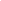

# CESOL Data Analysis

<div style="color: #6c757d; font-size: 0.85em; border-left: 4px solid #6c757d; padding-left: 10px; margin-bottom: 20px;">
⚠️ <b>Aviso:</b> Este sistema se trata de um showcase da versão original privada. Os dados e informações sensíveis foram modificados para manter a privacidade do negócio em sigilo e em adequação com a LGPD, mantendo apenas as métricas que foram aplicadas no projeto original, servindo então apenas como showcase.
</div>

[](https://evidence.dev)
[](https://duckdb.org/)
[](https://nodejs.org/)

# [Acessar Live Demo](https://thiago-p-almeida.github.io/cesol-data-analysis/)

## ❖ Visão Geral

O **CESOL Data Analysis** é um projeto de Business Intelligence (BI) e Data Analytics construído sobre o [Evidence.dev](https://evidence.dev/). Ele utiliza uma abordagem de *Modern Data Stack* para transformar modelos SQL em relatórios analíticos interativos, versionados e de alta performance.

### Principais Métricas Monitoradas
- **Alunos Ativos (`alunos_ativos`)**: Acompanhamento de engajamento e status de matrículas.
- **Motivos de Churn (`churn_motivos`)**: Análise detalhada dos vetores de evasão de estudantes.
- **Custos Operacionais (`custos_operacionais`)**: Monitoramento financeiro e alocação de recursos operacionais.

---

## ⚙ Arquitetura e Pipeline de Dados

O sistema faz parte de uma **Modern Data Stack** completa e eficiente, desenhada para garantir fluxo contínuo, escalabilidade e velocidade na análise de dados:

1. **Processamento Core (Python):** O pipeline de engenharia de dados inicia no sistema base desenvolvido em Python ([CESOL Dashboard](https://github.com/thiago-p-almeida/cesol_dashboard)). Neste ambiente, são realizados todos os cálculos pesados, transformações de dados e aplicação das regras de negócios.
2. **Armazenamento Otimizado (Parquet):** Os dados processados pelo Python são exportados e armazenados no formato columnar **Parquet**. Isso garante altíssima compactação e velocidade de I/O em análises.
3. **Motor Analítico (DuckDB):** Os arquivos Parquet são orquestrados e consumidos via **DuckDB** (embutido). Este banco de dados analítico de altíssimo desempenho permite realizar agregações pesadas em tempo de execução sem gargalos.
4. **Renderização de BI (Evidence.dev):** Os resultados em SQL são renderizados em alta velocidade no painel BI Evidence, utilizando páginas Markdown combinadas com componentes Svelte reativos.
5. **Automação de Deploy (CI/CD):** O painel está configurado e hospedado no GitHub Pages. Através do **GitHub Actions**, o sistema recebe e compila todas as atualizações em tempo real, publicando a versão mais recente do dashboard de forma totalmente automatizada.

---

## ■ Amostras

Confira abaixo as telas e visualizações do painel construído:




*(Imagens do showcase do painel analítico)*

---

## ▤ Como Executar o Projeto

Para rodar este projeto em sua máquina local, siga os passos abaixo:

1. **Clone o repositório:**
   ```bash
   git clone https://github.com/thiago-p-almeida/cesol-data-analysis.git
   cd cesol-data-analysis
   ```

2. **Instale as dependências:**
   ```bash
   npm install
   ```

3. **Construa as fontes de dados (DuckDB/Parquet):**
   ```bash
   npm run sources
   ```

4. **Inicie o servidor de desenvolvimento:**
   ```bash
   npm run dev
   ```
   Acesse `http://localhost:3000` em seu navegador para visualizar o painel analítico.

---

## ▤ Estrutura de Arquivos e Engenharia

```text
cesol-data-analysis/
├── data/                      # Arquivos transformados via Python
│   ├── alunos_ativos.parquet
│   ├── churn_motivos.parquet
│   └── custos_operacionais.parquet
├── pages/                     # Páginas Markdown definindo as visualizações do BI
│   └── index.md
├── sources/                   # Conectores e modelos SQL para o DuckDB
│   └── cesol_data/
│       ├── connection.yaml
│       ├── alunos_ativos.sql
│       ├── churn_motivos.sql
│       └── custos_operacionais.sql
├── evidence.config.yaml       # Configuração central do Evidence
└── package.json               # Dependências do projeto
```

---

## ◈ Segurança e LGPD

Todo o fluxo de dados atende rigorosamente às diretrizes de Governança de Dados e à **LGPD**. Como se trata de um showcase, quaisquer Informações Pessoais Identificáveis (PII) ou dados financeiros sensíveis foram mascarados ou removidos logo nas camadas iniciais de processamento, evitando que a camada de BI (Evidence) manipule informações reais do projeto original.
